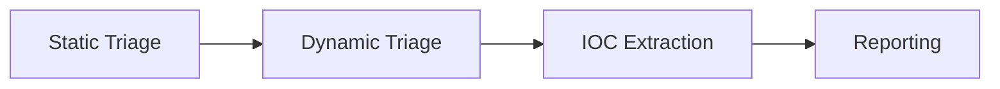

> **Note**: This is a benign, simulated sample used for practice. Never upload live malware to this site.

## 1) Lab context
- VM: Windows 10 (isolated, snapshots)
- Tools: strings, peview, Ghidra, Procmon, x64dbg, Wireshark (user-mode NAT)

## 2) Static triage (safe overview)
- PE header: 64-bit, console subsystem
- Strings (selected, benign): `C:\Users\Public\Documents`, `note.txt`, `HKCU\Software\Microsoft\Windows\CurrentVersion\Run`

```bash
# example (run inside VM)
strings.exe sample.exe | findstr /i "http hkcu run"
```

## 3) Dynamic triage (constrained)
- Creates `C:\Users\Public\Documents\RansomNoteSim\note.txt` with a **non-malicious** message.
- Writes a Run key for persistence (simulated).
- Network: none observed (benign).

## 4) IOCs (for defensive use)
| Type | Value |
|---|---|
| File path | `C:\Users\Public\Documents\RansomNoteSim\note.txt` |
| Registry | `HKCU\...\Run\RansomNoteSim` |
| Hash (fake) | `aaaaaaaa...` |

## 5) ATT&CK mapping (indicative)
- T1059 (Command & Scripting Interpreter) – *if scripts observed*
- T1060/T1547.001 (Registry Run Keys/Startup Folder)

## 6) Defensive detections
### YARA (conceptual, do **not** match on live ransomware families)
```
rule RansomNoteSim_Training
{{
    meta:
        author = "Student"
        description = "Training-only demo"
    strings:
        $s1 = "RansomNoteSim" ascii
        $s2 = "This is a benign training sample" ascii
    condition:
        2 of them
}}
```


